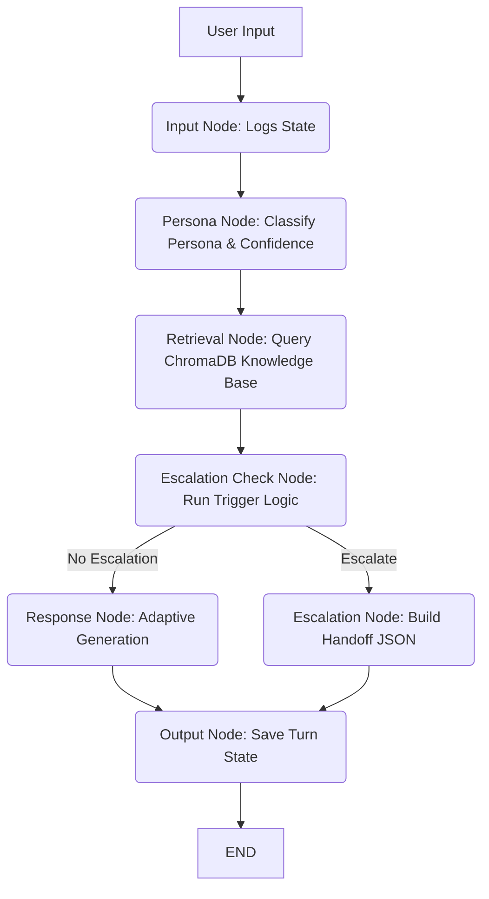

# 🤖 NovaSuite: Persona-Adaptive Customer Support Agent

NovaSuite is a production-grade, AI-powered customer support application that dynamically adapts its responses to user personalities and technical requirements. Powered by **LangGraph**, **Gemini LLMs**, and **Retrieval-Augmented Generation (RAG)**, NovaSuite parses customer requests, queries a localized knowledge base, determines the user's emotional/professional persona, and tailors the output accordingly. 

If the query is too complex, contains sensitive issues, or the user shows persistent dissatisfaction, the system compiles a standardized human-handoff package and escalates the ticket.

---

## 🗺️ Architecture Overview

The system runs on a structured state machine managed by **LangGraph**. The workflow enforces consistency, prevents hallucinations, and manages complex multi-turn logic:



### LangGraph Nodes
*   **Input Node:** Receives user query, initializes or updates state variables (e.g., turn count, sentiment tracking, attempts).
*   **Persona Node:** Evaluates the user's tone and historical messages to classify them into standard user personas.
*   **Retrieval Node:** Embeds user queries using Google's `text-embedding-004` and fetches relevant segments from ChromaDB.
*   **Escalation Check Node:** Evaluates retrieval confidence, sentiment, attempts, and keywords against escalation safety policies.
*   **Response Node:** Executes the LLM response engine, prompting Gemini using custom persona instructions.
*   **Escalation Node:** Generates a machine-readable `HandoffSummary` JSON payload containing the context needed by human agents.
*   **Output Node:** Finalizes the state payload, logging outputs to memory and the console.

---

## ⚡ Core Features

1. **Dynamic Persona Detection:**
   * **Technical Expert:** Receives highly detailed, API-heavy, markdown-formatted responses emphasizing specifications and configuration parameters.
   * **Business Executive:** Receives concise, high-level summaries focusing on SLAs, subscription impacts, and business outcomes.
   * **Frustrated User:** Receives highly empathetic, de-escalating responses with simplified, action-oriented troubleshooting steps.

2. **Advanced RAG Pipeline:**
   * Utilizes **ChromaDB** for local vector indexing.
   * Embeds files with Google's `text-embedding-004`.
   * Automatically extracts and formats source documents and retrieval confidence scores.

3. **Multi-Trigger Escalation Engine:**
   * **Low-Confidence Trigger:** Automatically escalates if search results score below 50% confidence.
   * **Keyword Triggers:** Scans for high-priority keywords (e.g., *sue*, *legal*, *cancel*, *refund*).
   * **Dissatisfaction Triggers:** Recognizes phrases indicating unresolved frustration.
   * **SLA/Attempts Triggers:** Escalates when the turn count exceeds configured limits or if the issue remains unresolved after multiple attempts.

4. **Interactive Support Dashboard:**
   * Streamlit dashboard with real-time sentiment line charts.
   * Collapsible source document viewers.
   * Direct visual indicators for current active persona, confidence scores, and raw handoff JSON logs.

---

## 🛠️ Step-by-Step Installation & Setup

### Prerequisites
*   Python 3.11 or higher
*   Git
*   A Google Gemini API key

### Step 1: Clone the Repository
```bash
git clone https://huggingface.co/spaces/hemanthreddy56/Adsparkx_AI
cd Adsparkx_AI
```

### Step 2: Install Dependencies
It is recommended to run the project in a virtual environment:
```bash
# Create and activate virtual environment
python -m venv venv
source venv/bin/activate  # On Windows: .\venv\Scripts\activate

# Install required packages
pip install -r requirements.txt
```

### Step 3: Configure Environment Variables
Copy `.env.example` to a new file named `.env` and fill in your Gemini API key:
```bash
cp .env.example .env
```

Ensure your `.env` contains:
```env
GEMINI_API_KEY=your_gemini_api_key_here
GEMINI_FLASH_MODEL=gemini-2.5-flash
GEMINI_LITE_MODEL=gemini-2.5-flash-lite
GEMINI_EMBEDDING_MODEL=models/gemini-embedding-2
CHROMA_PERSIST_DIR=./chroma_db
CHROMA_COLLECTION=novasuite_support_kb
TOP_K_RETRIEVAL=5
LOW_CONFIDENCE_THRESHOLD=0.50
NEGATIVE_SENTIMENT_THRESHOLD=-0.40
MAX_TURNS_BEFORE_REVIEW=5
MAX_RESOLUTION_ATTEMPTS=3
KB_DATA_DIR=./data
LOG_LEVEL=INFO
```

### Step 4: Ingest the Knowledge Base
Run the ingestion script to parse the source text/markdown/PDF documents under `data/` and index them into ChromaDB:
```bash
python scripts/ingest_kb.py
```

### Step 5: Start the Application

#### Streamlit UI Dashboard (Recommended)
```bash
python app.py
```
This launches a browser-based dashboard at `http://localhost:8501` featuring interactive chat, live sentiment analysis, active persona status, and live escalation monitoring.

#### CLI Interface
If you want to interact with the support agent directly in your console:
```bash
python ui/cli.py
```

### Step 6: Running the Tests
To execute the automated unit and integration tests:
```bash
pytest --tb=short -v
```

---

## 🐳 Docker Deployment

The application is pre-configured with a multi-stage Dockerfile optimized for Hugging Face Spaces and container environments.

### Build the Image
```bash
docker build -t novasuite-support-agent .
```

### Run the Container Locally
Pass your Gemini API key as an environment variable:
```bash
docker run -p 7860:7860 -e GEMINI_API_KEY="your_api_key_here" novasuite-support-agent
```
The application will start, build/verify its vector database index, and serve the dashboard on port `7860`.

---

## 🚀 Production Deployment Considerations

*   **State & Session Management:** The default configuration stores session data in memory. For horizontal scaling in production, switch the LangGraph Memory Saver to a persistent database back-end such as Redis, PostgreSQL, or SQLite.
*   **Vector Database Scaling:** ChromaDB is run as a local persistent directory (`./chroma_db`). In high-traffic production environments, consider migrating ChromaDB to a client-server architecture or using a cloud-managed service (e.g., Pinecone, Qdrant).
*   **Secrets & Key Management:** Never commit your `.env` file. On platforms like Hugging Face Spaces, configure your credentials under **Settings > Variables and Secrets** as Secret keys.
*   **Rate Limits and Quotas:** The system contains built-in rate-limit guards. For high-volume environments, configure exponential back-off retries and caching layers to minimize API rate limit exhaustion.
